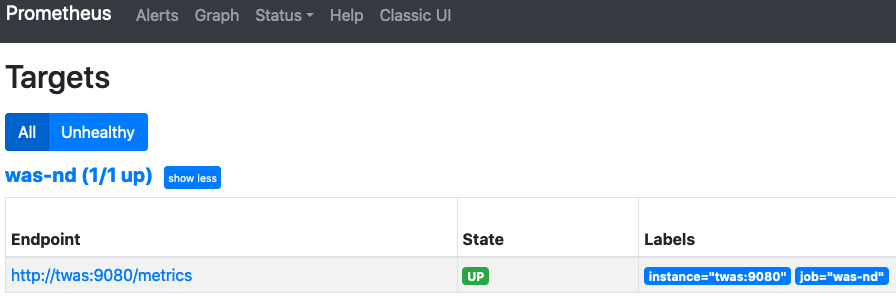
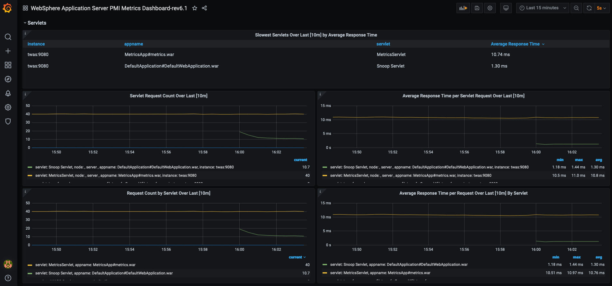

# Docker Quickstart for WebSphere Application Server traditional PMI metrics with Prometheus and Grafana

This repository contains a Docker compose file to quickly set up WebSphere Application Server traditional Performance Monitoring Infrastructure (PMI) metrics with Prometheus and Grafana. 

The Docker compose file will run the following containers:
- ibmcom/websphere-traditional:latest
- prom/prometheus:latest
- grafana/grafana

## Set-up
 1. Clone this repository
 2. Run the following command to build and start the WebSphere Application Server traditional Docker image : <br>
    `docker-compose up --build`

Notes: 
- The WebSphere Application Server traditional container may take a 1-2 minutes to start up. <br>
- In order for the DefaultApplication.ear application to work with the metrics.ear application, you must install the [PH35521](https://www.ibm.com/support/pages/node/643615) Interim Fix. Please follow the instructions [here](https://github.com/WASdev/ci.docker.websphere-traditional#installing-ifixes) on how to install Interim Fixes on your WebSphere Application Server traditional Docker image.

## Usage

### WebSphere Application Server traditional
The latest version of WebSphere Application Server traditional 9.0.5 will be installed from the [Dockerfile](twas/Dockerfile), along with the installation of the DefaultApplication.ear and the metrics.ear applications from the `<WAS_HOME>/installableApps` directory to the application server, using a [jython script](twas/install_app.py), that will be running in a container named: `twas_metrics` 

- Access the Administrative Console at https://localhost:9043/ibm/console/login.do?action=secure
     - Note: The login credentials for the Admin Console is as follows : 
        - User ID: `wsadmin`
        - Password: A generated password, which can be retrieved from the running container using the following command: `docker exec twas_metrics cat /tmp/PASSWORD`
- Visit the sample Snoop Servlet from the DefaultApplication.ear application to generate PMI Web Application Module metrics : http://localhost:9080/snoop
- Visit the Prometheus metrics endpoint to view the PMI metrics from the running WebSphere Application Server traditional container in Prometheus format : http://localhost:9080/metrics

### Prometheus

The configuration for Prometheus is done via a file called [prometheus.yml](prometheus/prometheus.yml), which tells it where to scrape the metrics from and how long the interval should be between each scrape. The following prometheus configuration is set for this sample, where the `scrape_configs` section has one job called `was_nd`. In this job, prometheus is configured to scrape the `twas:9080/metrics` endpoint every 5 seconds, which is from the running `twas_metrics` container.

prometheus.yml
```
# my global config
global:
  scrape_interval: 15s # Set the scrape interval to every 15 seconds. Default is every 1 minute.
  evaluation_interval: 15s # Evaluate rules every 15 seconds. The default is every 1 minute.
  # scrape_timeout is set to the global default (10s).

# A scrape configuration containing exactly one endpoint to scrape:
# Here it's Prometheus itself.
scrape_configs:
  # The job name is added as a label `job=<job_name>` to any timeseries scraped from this config.
  - job_name: 'was-nd'
    # metrics_path defaults to '/metrics'
    # scheme defaults to 'http'.
    scrape_interval: 5s
    static_configs:
      - targets: ['twas:9080']
```
- Access the Prometheus Server UI: http://localhost:9090
    - Verify under the Status->Targets, to see if Prometheus can successfully connect to the configured metrics endpoint from the running `twas_metrics` container.
    

### Grafana

The Prometheus datasource will be automatically preconfigured for you, when the `grafana` container is started, which will configure Grafana to connect to the prometheus container (http://localhost:9090), to collect the metrics for visualization (see [datasource.yml](grafana/datasources.yml)). A sample WebSphere Application Server PMI metrics Dashboard is also imported to the running `grafana` container (see [dashboards.yml](grafana/dashboards.yml) and [WebSphere Application Server PMI Metrics Dashboard-rev2.json](grafana/dashboards/websphere-application-server-pmi-metrics-dashboard_rev2.json). This dashboard leverages the Prometheus formatted metric data to visualize CPU, Memory Heap, Servlets, EJBs, Connection Pool, SIB, Sessions, Threadpool, Garbage Collection, and other JVM metrics of the entire cell. This dashboard can also be found [here](https://grafana.com/grafana/dashboards/14151) on the official Grafana.com website with dashboard ID : `14151`.

- Access the Grafana UI: http://localhost:3000
    - Use the following credentials to login to Grafana :
        - Username: `admin`
        - Password: `admin`
- Visualize the WebSphere Application Server traditional PMI metrics, by clicking on the imported WebSphere Application Server PMI Metrics Dashboard, in the Dashboard section.
    - If you expand the Servlets section, you can view the corresponding Web Application Module PMI metrics for the sample Snoop Servlet, we installed in our WebSphere Application Server traditional (`twas_metrics`) container.


## Uninstall
 - To stop the containers, run the following command : <br>
   `docker-compose down`

## Resources
- For more information on using the metrics application to display PMI metrics in Prometheus format, visit [here](https://www.ibm.com/docs/en/was-nd/9.0.5?topic=dyoma-using-metrics-app-display-pmi-metrics-in-prometheus-format).
- Find more information on the WebSphere Application Server traditional Docker image [here](https://github.com/WASdev/ci.docker.websphere-traditional).
- For more information on Prometheus, visit [here](https://prometheus.io/docs/introduction/overview/).
- For more information on Grafana, visit [here](https://grafana.com/docs/).